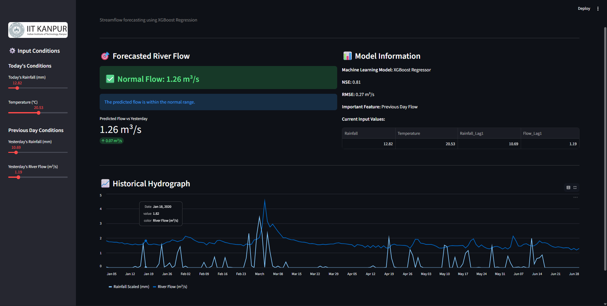

# 🌊 Arno River Hydrology AI: Streamflow Forecasting Dashboard


## 📌 Project Overview
This project is an end-to-end Machine Learning surrogate model designed to forecast the hydrometric river level (discharge) of the Arno River in Italy. By processing 20+ years of meteorological forcings (rainfall and temperature), the application dynamically trains and predicts the river's response using a highly optimized **XGBoost Regressor**.

The project is deployed as an interactive **Streamlit SCADA-style dashboard** that allows engineers to simulate weather conditions, analyze historical hydrographs, and monitor a dynamic flood-risk warning system in real-time.

---

## 📸 Dashboard Preview


---

## 🚀 Key Engineering Highlights
* **Domain-Specific Feature Engineering:** Translated hydrological physics into mathematical features, including Antecedent Catchment Saturation (3, 7, 15, and 30-day rolling rainfall sums and standard deviations) and Exponentially Weighted Moving Averages (EWMA) for baseflow memory.
* **Robust Time-Series Handling:** Strictly utilized chronological data sorting and forward/backward-fill imputation to prevent future data leakage during feature generation.
* **Hydrological Evaluation Metric:** The model architecture was evaluated using **Nash-Sutcliffe Efficiency (NSE)**—the global civil engineering standard—achieving a highly accurate score of **0.81**.
* **Dynamic In-Memory Caching:** The Streamlit deployment utilizes `@st.cache_data` and `@st.cache_resource` to efficiently load the dataset, compute rolling features, and train the optimized XGBoost model in memory without lagging the user interface.

---

## 📊 Model Performance
* **Algorithm:** XGBoost Regressor 
* **Hyperparameters:** `n_estimators=200`, `learning_rate=0.05`, `max_depth=4`, `subsample=0.8`
* **Nash-Sutcliffe Efficiency (NSE):** 0.81
* **Root Mean Squared Error (RMSE):** 0.27 m³/s

---

## 📂 Repository Structure

```text
Arno-River-Hydrology-AI/
│
├── data/                       
│   └── water_data.csv          # Raw historical meteorological data
│
├── notebook/
│   └── Streamflow_Model.ipynb  # Clean ML pipeline (EDA, Feature Eng, CV, SHAP)
│
├── Dashboard.png               # Screenshot of the Streamlit app for the README
├── README.md                   # Project documentation
├── app.py                      # Streamlit dashboard deployment script
├── logo.png                    # IIT Kanpur / Project logo for the dashboard sidebar
└── requirements.txt            # Python dependencies
